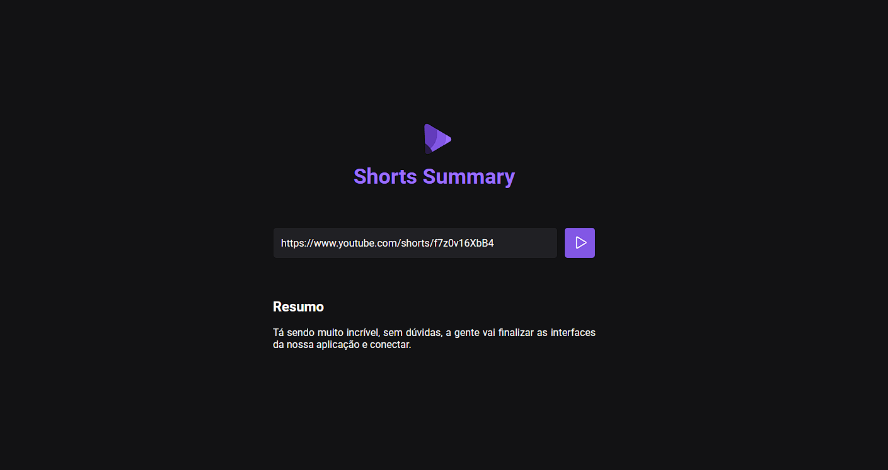

<h1 align="center"> Shorts Summary </h1>

Aplicação que converte um vídeo Shorts do youtube em texto resumido. 

  

## 🚀 Tecnologias

Esse projeto foi desenvolvido com as seguintes tecnologias:

- HTML e CSS
- JavaScript
- Node.js
- Git e Github
- Figma

## 💻 Projeto

Shorts Summary é uma aplicação de ponta a ponta integrada entre Front-end e Back-end.

